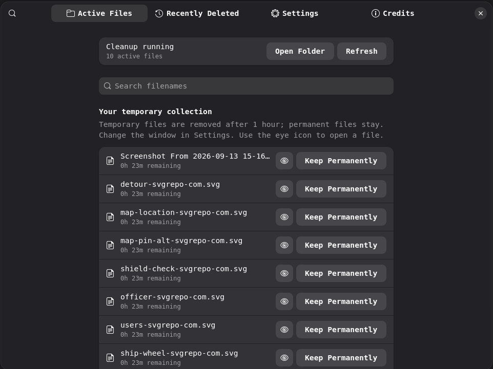
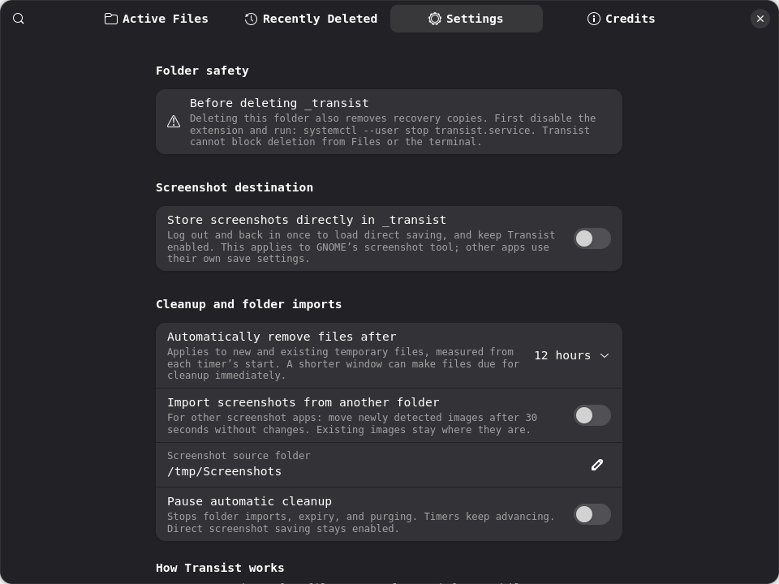

# Transist

**A simple GNOME extension for files you only need temporarily.**

Transist gives you a private `~/_transist` folder. Put temporary files there,
choose how long they should stay, and let Transist clean them up automatically.
Deleted files are kept in Transist recovery storage for seven days, so you can
restore them when needed.

## Screenshots

### Active files

See your files, search by filename, open a file, make it permanent, or restore
its temporary status.



### Settings

Choose the cleanup time, configure screenshots, pause cleanup, and view folder
safety information.



## Features

- Choose a cleanup time of **1, 5, 12, 24, 48, or 72 hours, or 1 week**.
- Files are automatically removed when their selected time ends.
- Removed files can be recovered for **seven days**.
- Restored files receive a new timer using your current cleanup setting.
- Mark individual files as permanent so they never expire.
- Search active files and recently removed files.
- Save GNOME screenshots directly into `_transist` or import screenshots from another folder.
- Pause automatic cleanup whenever you need to keep working in the folder.
- GNOME Files helps prevent accidental deletion of the whole `_transist` folder.

## How It Works

1. Open Transist preferences and choose a cleanup time in **Settings**.
2. Click **Open Folder** and place a file directly inside `~/_transist`.
3. Transist starts the timer when it notices the file.
4. When the timer ends, the file is moved out of the visible folder into Transist's private recovery storage.
5. The file appears in **Recently Deleted** and can be restored for seven days.
6. Restoring a file returns it to `_transist` with a fresh timer.
7. After seven days, its recovery copy is permanently removed.

The folder is intended for regular files placed directly inside `_transist`.
Subfolders and special files are left alone.

### Keep a file permanently

In **Active Files**, click **Keep Permanently** for a file. It stays in
`_transist` until you remove it yourself. Click **Make Temporary** later to
start a new timer.

## Install

### Requirements

- GNOME Shell 45 or newer, with GTK 4 and libadwaita
- Python 3.10 or newer
- A systemd user session for automatic cleanup

For GNOME Files folder protection, the installer also needs `python3-nautilus`,
PyGObject, and a C compiler such as `gcc`.

### Install or upgrade

1. Download or extract the project.
2. Open a terminal in the project folder.
3. Run the installer as your normal user. Do not use `sudo`:

```bash
python3 install.py
```

4. Restart GNOME Files:

```bash
nautilus --quit
```

5. Log out and log in again so GNOME loads the extension.
6. Enable Transist and open its preferences:

```bash
env -u XDG_DATA_HOME -u XDG_CONFIG_HOME \
  gnome-extensions enable transist@aaryabalan.local

env -u XDG_DATA_HOME -u XDG_CONFIG_HOME \
  gnome-extensions prefs transist@aaryabalan.local
```

You can also open Transist from **GNOME Extensions**. There is no separate
desktop application.

### Optional installation choices

Install without GNOME Shell integration:

```bash
python3 install.py --no-extension
```

Install without GNOME Files folder protection:

```bash
python3 install.py --no-file-manager-guard
```

## Daily Use

1. Open **Transist preferences**.
2. Choose your cleanup time in **Settings**.
3. Click **Open Folder**.
4. Put temporary files directly inside `~/_transist`.
5. Use **Active Files** to open files or make selected files permanent.
6. Use **Recently Deleted** to restore a removed file within seven days.

Transist continues cleaning files while the preferences window is closed. The
list normally refreshes every few seconds. New or changing files are given a
short settling period before their timer can finish.

## Delete the `_transist` Folder

The folder contains both your visible files and Transist's recovery copies.
Deleting the whole folder removes access to those recovery copies. History is
not a backup.

### Delete it safely in GNOME Files

1. Open **GNOME Extensions**.
2. Disable **Transist**.
3. Open GNOME Files and move `~/_transist` to Trash or delete it.
4. Restart GNOME Files if it was already open:

```bash
nautilus --quit
```

When Transist is enabled, GNOME Files blocks deletion of the root folder to
help prevent accidents. Files inside the folder can still be removed normally.

### Delete it from a terminal

Stop the cleanup service first:

```bash
systemctl --user stop transist.service
rm -rf "$HOME/_transist"
```

Only run this command when you are certain that you no longer need the files or
their recovery copies.

## Uninstall

From the project folder, run:

```bash
python3 install.py --uninstall
```

Uninstalling stops the service and removes Transist's installed program files.
It keeps your active files, but removes Transist's recovery tracking and
history. Restart GNOME Files after uninstalling.

## License

MIT licensed. See [LICENSE](LICENSE).
